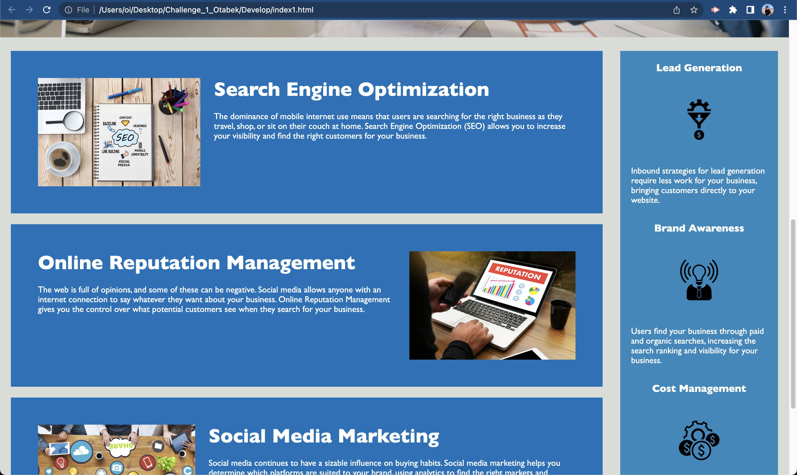
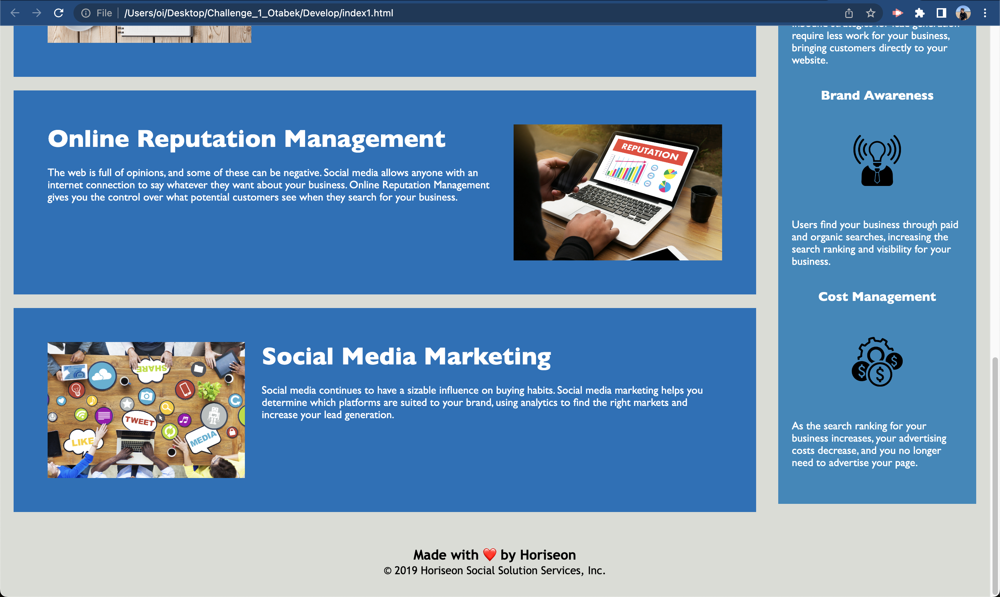

## Horiseon-Site

# Deployment Link 

https://otabek0111.github.io/Horiseon-Site
# Website

This is a sample website for demonstrating semantic HTML and basic CSS styling. The purpose of this project is to showcase the use of proper HTML structure and CSS organization to create a visually appealing and accessible website.

## Screenshots

Screenshot 1 of My Application (Screen shot of top of the webpage)

Screenshot 2 of My Application

Screenshot 3 of My Application

## Technologies Used

- HTML
- CSS

## Installation

1. Clone the repository: `git clone https://github.com/Otabek0111/Horiseon-Site.git
2. Navigate to the project directory: `cd Horiseon-Site`
3. To open code: code . will open the dirctory in VS code
4. Open in default browser to see web site

## Usage

1. Open the `index.html` file in a web browser.
2. Explore the different sections of the website to learn about the services offered by Horiseon.
3. Navigate through the links in the navigation menu to jump to different sections of the page.

## Contributions 

1. Colaborated with classmembers 
2. Received assistance from AskBCS Learning Assistant 

## Contributing

1. Contributions are welcome! If you have any suggestions or improvements, please create a new issue or submit a pull request.
